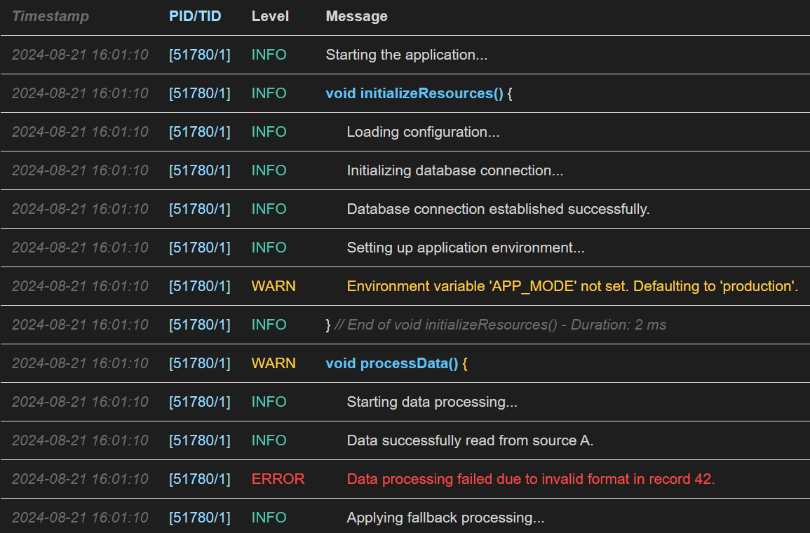

# Logify

This project provides a simple and modern C++ Logger with many features.

## Features

- **Multiple Log Levels**: Supports TRACE, DEBUG, INFO, WARN, ERROR, and FATAL log levels.
- **Output Streams**: Log to the console, files (with optional rotation), and more.
- **File Rotation**: Automatically rotate log files when they reach a specified size.
- **Scoped Logging**: Automatically logs the entry and exit of code scopes, along with execution duration.
- **Customizable Time Formats**: Define how timestamps are formatted in log messages.
- **Color Schemes**: Customize log output colors for better readability, especially useful for console logs and HTML
  files.
- **Thread-Safe**: Logify ensures that your logs are consistent and reliable even in multi-threaded environments.

## Installation

To integrate Logify into your project, you can either download the source and include it directly or use CMake for a
more streamlined setup.

### Using Logify with CMake

1. **Include Logify in Your Project:**

   If Logify is a submodule or part of your source tree:
   ```cmake
   add_subdirectory(Logify)
   ```

   If Logify is installed on your system:
   ```cmake
   find_package(Logify REQUIRED)
   ```

2. **Link Logify to Your Target:**

   In your CMakeLists.txt, link Logify to your executable or library:
   ```cmake
   target_link_libraries(SomeExecutable PRIVATE Logify::Logify)
   ```

3. **Include Logify Headers:**

   In your C++ files, include Logify headers as needed:
   ```cpp
   #include <Logify/Logify.h>
   #include <Logify/ScopedLogger.h>
   ```

## Usage Example

Here’s a simple example demonstrating how to use Logify in your project:

```cpp
#include <iostream>
#include <Logify/Logify.h>
#include <Logify/ScopedLogger.h>

// Define the global logger instance
Logify::Logger logger;

int main() {
    // Initialize the logger
    logger.addOutputStream(std::cout);
    logger.addFileStream("application.log");

    // Start logging
    logger.info("Application started");

    {
        LOGIFY_SCOPED_LOGGER();  // Automatically logs the entry and exit of this scope
        logger.debug("This is a debug message within a scoped log.");
    }

    logger.error("An error occurred!");
    logger.fatal("Fatal error encountered, shutting down.");

    return 0;
}
```

This example demonstrates how to set up a basic logger, add output streams, and use scoped logging to automatically
manage log entries and exits within a scope.

## HTML Logging

Logify provides the ability to generate HTML-formatted log files. This is particularly useful when you want to review
logs in a web browser with a clear, styled format. You can define custom color schemes to match your needs.

### Enabling HTML Logging

To enable HTML logging, you can add a file stream with an HTML extension and optionally provide a color scheme:

```cpp
logger.addFileStream("application.html", 10 * 1024 * 1024, Logify::DefaultDarkScheme);
```

This will generate an HTML file with your logs, including a table format with customizable colors for different log
levels.

Below is an overview of HTML logging



[View the Logify HTML Logs](./media/application_0000.html)

### Custom Color Schemes

You can customize the colors used in HTML logs by defining your own `ColorScheme`:

```cpp
Logify::ColorScheme myColorScheme = {
    "#FFFFFF",  // Background
    "#000000",  // Timestamp
    "#FF5733",  // PID/TID
    "#C70039",  // Default color
    "#900C3F",  // Debug
    "#DAF7A6",  // Info
    "#FFC300",  // Warn
    "#FF5733"   // Error
};

logger.addFileStream("custom_logs.html", 10 * 1024 * 1024, myColorScheme);
```

This will create an HTML log file with your specified colors, making it easy to visually distinguish between different
log levels.

## Customization

### Log Levels

Logify supports the following log levels:

- `TRACE`
- `DEBUG`
- `INFO`
- `WARN`
- `ERROR`
- `FATAL`

You can set the desired log level when initializing the logger:

```cpp
logger.setLogLevel(Logify::LogLevel::DEBUG);
```

### Scoped Logging

Scoped logging is a powerful feature that logs the start and end of a scope, along with the duration of the scope:

```cpp
void someFunction() {
    LOGIFY_SCOPED_LOGGER();
    // Code here will be timed and logged automatically
}
```

### File Rotation

Logify can rotate log files when they reach a specified size:

```cpp
logger.addFileStream("rotating.log", 5 * 1024 * 1024);  // 5 MB rotation size
```

### Color Schemes

Logify allows you to define custom color schemes for your logs:

```cpp
logger.addFileStream("colored.html", 10 * 1024 * 1024, Logify::DefaultDarkScheme);
```


## Contributing

Contributions are welcome! Whether it's a bug fix, new feature, or documentation improvement, your help is appreciated.
Please open an issue or submit a pull request on GitHub.
## License

This project is licensed under the BSD-3-Clause License. See the LICENSE file for more details.

## Contact

For any questions or support, please contact Mustafa Alotbah at [mustafa.alotbah@gmail.com](mailto:mustafa.alotbah@gmail.com).